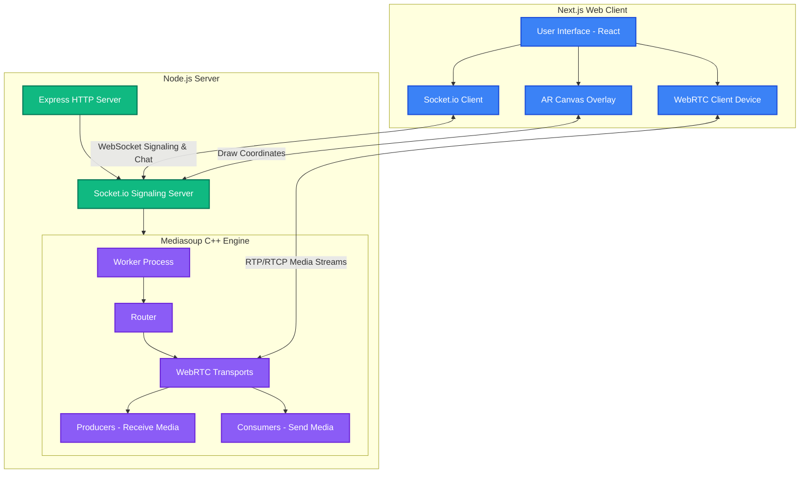

# Login Credentials & Architecture Diagram

## Login Credentials & Role Access
SupportLens uses a frictionless role-switching system for demonstration and judging purposes. No username or password is required to test the core functionality.

**To switch between Agent and Customer roles during judging:**
1. Open the application at `http://localhost:3000` (or your provided Demo URL).
2. On the landing page, you will see a prominent toggle: **"I am joining as: Agent / Customer"**.
3. **Agent Role:** Select "Agent", enter your name and a Room ID (e.g., `123`). This grants you privileges to draw AR annotations.
4. **Customer Role:** Open a second browser window, select "Customer", enter a name and the **exact same Room ID** (e.g., `123`). 

You will instantly be connected in the same room with the correct role-based permissions applied.

---

## Architecture Diagram

Our solution utilizes an Enterprise-Grade SFU Architecture. Rather than relying on simple peer-to-peer mesh WebRTC, we route all media through a C++ Mediasoup server. This ensures we strictly adhere to the rule of routing media through our own infrastructure while enabling features like graceful network degradation.

